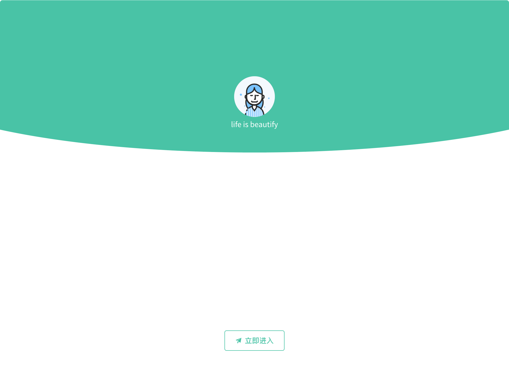
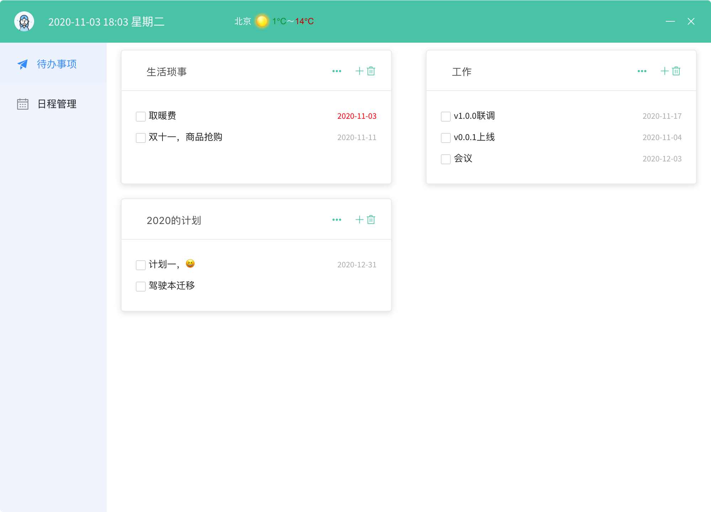
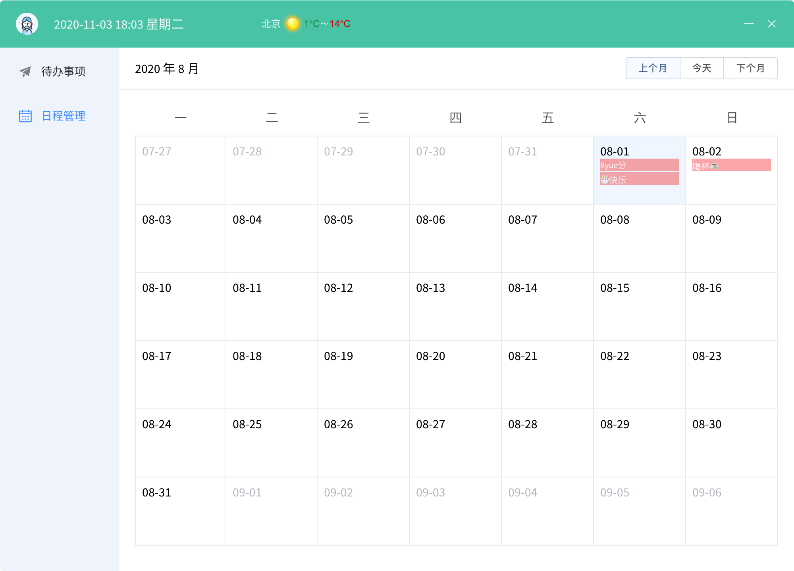

# electron-vue-project

> An electron-vue project
基于【electron-vue】做的【桌面端】demo项目

#### Build Setup

``` bash
# install dependencies
npm install

# serve with hot reload at localhost:9080
npm run dev

# build electron application for production
npm run build

```
### 项目预览
 
 
 

